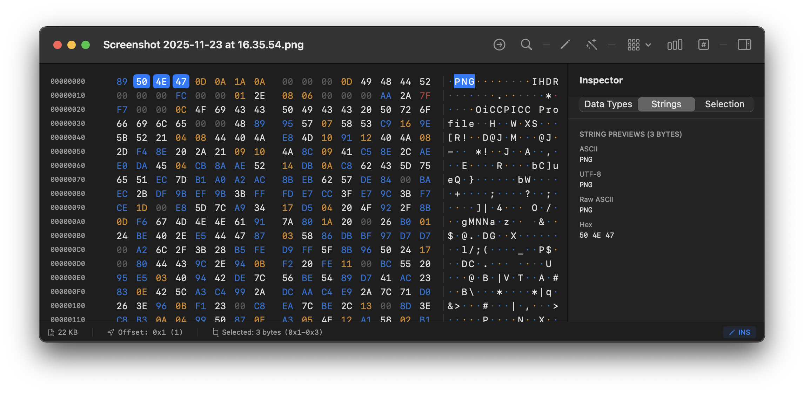
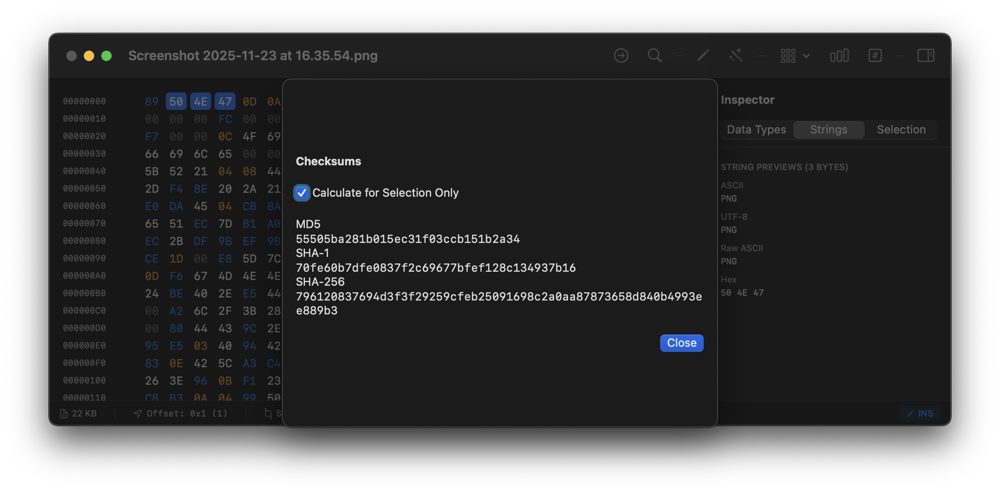

# HxEditor

<p align="center">
  
</p>

**HxEditor** is a powerful, native macOS hex editor built with SwiftUI. Designed for developers, security researchers, and anyone working with binary files, it combines professional-grade features with an intuitive, modern interface.

## ✨ Features

### 🎯 Core Editing
- **Flexible Input Modes**: Switch between ASCII and hex input (⌘G)
- **Multi-Byte Selection**: Drag to select, Shift+Arrow to extend
- **Insert/Overwrite Modes**: Toggle with Insert key
- **Smart Operations**: Copy, Cut, Paste, Duplicate, Delete, Zero Out
- **Undo/Redo Support**: Full undo history for all operations
- **Context Menus**: Right-click any byte for quick actions

### 🔍 Search & Navigation
<p align="center">
  
</p>

- **Powerful Search**: Find hex patterns or ASCII/UTF-8 text (⌘F)
- **Find & Replace**: Replace single or all occurrences
- **Jump to Offset**: Navigate directly to any position (⌘J)
- **Bookmarks**: Mark important locations (⌘B)
- **Keyboard Navigation**: Arrow keys with selection support

### 📊 Analysis Tools

#### File Statistics
<p align="center">
  
</p>

- Byte distribution histogram
- Entropy calculation
- Min/Max/Average values
- Pattern detection

#### Checksum Calculator
<p align="center">
  
</p>

- MD5, SHA-1, SHA-256, SHA-512
- CRC32 checksums
- Calculate for entire file or selection
- One-click copy to clipboard

#### String Extraction
<p align="center">
  
</p>

- Extract ASCII and Unicode strings
- Configurable minimum length
- Filter by string type
- Search within results
- Click to jump to location
- Export strings to clipboard

### 🔄 File Comparison
<p align="center">
  
</p>

- **Side-by-Side View**: Compare two files simultaneously
- **Difference Highlighting**: Color-coded changes (red for modifications)
- **Synchronized Scrolling**: Both files scroll together
- **Smart Navigation**: Jump between differences with ⌘[ and ⌘]
- **Statistics**: Total blocks, bytes changed, match percentage
- **Show Only Differences**: Toggle to hide matching regions
- **Efficient Algorithm**: Handles large files with optimized Myers diff

### 📤 Export Options
<p align="center">
  
</p>

Export your data in multiple formats:
- **C Array**: Perfect for embedding in source code
- **Python Bytes**: Ready-to-use Python byte strings
- **Base64**: Web-safe encoding
- **Hex Dump**: Traditional hex dump format
- **Raw Binary**: Export selection as binary file

### 🏷️ Metadata Editor
<p align="center">
  
</p>

- Add custom tags and notes to files
- Track file analysis progress
- Color-coded priority levels
- Save metadata alongside files
- Search and filter by metadata

### 👁️ Inspector Panel
- **Data Type Interpretation**: View bytes as int8/16/32/64, float, double
- **Endianness Support**: Toggle between little and big endian
- **String Preview**: ASCII, UTF-8, and raw views
- **Binary Representation**: See raw binary patterns
- **Selection Info**: Offset, length, and statistics

### 🎨 Visual Features
- **Byte Grouping**: Configure display (1, 2, 4, 8, 16 bytes)
- **Color Coding**: Printable ASCII (blue), control chars (gray), extended (purple)
- **Dual Pane View**: Synchronized hex and ASCII
- **Selection Highlighting**: Clear visual feedback
- **Native macOS Design**: Full Dark Mode support

### ⚡ Performance
- **Large File Support**: Handles 10MB+ files smoothly
- **Gap Buffer**: Efficient data structure for editing
- **Lazy Rendering**: Only visible rows rendered
- **Range-Based Selection**: Instant selection queries
- **Optimized Scrolling**: Smooth even with large files

## 🎹 Keyboard Shortcuts

### Navigation
- **Arrow Keys** - Move cursor
- **Shift+Arrows** - Extend selection
- **⌘A** - Select all
- **⌘J** - Jump to offset

### Editing
- **⌘C** - Copy
- **⌘X** - Cut  
- **⌘V** - Paste
- **⌘D** - Duplicate selection
- **⌘I** - Insert data
- **Backspace** - Delete byte
- **⌘0** - Zero out selection
- **⌘Z** - Undo
- **⌘⇧Z** - Redo

### Modes & Tools
- **⌘G** - Toggle hex input mode
- **Tab** - Switch hex/ASCII focus
- **⌘F** - Find
- **⌘B** - Toggle bookmark
- **⌘[** - Previous difference (compare mode)
- **⌘]** - Next difference (compare mode)

## 🚀 Getting Started

### Requirements
- macOS 13.0 or later
- Xcode 15.0+ (for building from source)

### Installation

#### From Source
```bash
# Open in Xcode
open HxEditor.xcodeproj

# Build and run (⌘R)
```

### Usage

1. **Open a File**: Use File → Open (⌘O) or drag & drop
2. **Edit**: Click bytes to select, type to edit
3. **Switch Modes**: Press ⌘G for hex input mode
4. **Analyze**: Use toolbar buttons for analysis tools
5. **Export**: Use ⌘E or toolbar button

## 🏗️ Architecture

### Technologies
- **SwiftUI**: Modern declarative UI framework
- **CryptoKit**: Native checksum calculations
- **Combine**: Reactive state management
- **AppKit Integration**: For advanced file operations

### Data Structures
- **Gap Buffer**: O(1) insertion/deletion at cursor
- **Range-Based Selection**: O(1) selection queries
- **Lazy Collections**: Efficient memory usage

### Algorithms
- **Myers Diff**: Industry-standard comparison algorithm
- **Rolling Hash (Rabin-Karp)**: Fast pattern matching
- **xxHash64**: High-speed chunk hashing for diffs

## 📁 Project Structure

```
HxEditor/
├── HxEditor/
│   ├── HxEditorApp.swift           # App entry point
│   ├── ContentView.swift            # Main coordinator view
│   ├── HexGridView.swift            # Hex/ASCII grid
│   ├── HexTextView.swift            # NSTextView-based renderer
│   ├── DataBuffer.swift             # Gap buffer implementation
│   ├── HexDocument.swift            # Document model
│   ├── SearchView.swift             # Find & Replace
│   ├── ComparisonContentView.swift  # File comparison UI
│   ├── DiffEngine.swift             # Diff algorithm
│   ├── StringExtractor.swift        # String extraction
│   ├── ExportView.swift             # Export formats
│   ├── MetadataManager.swift        # File metadata
│   ├── ChecksumView.swift           # Checksum calculator
│   ├── StatisticsView.swift         # File statistics
│   ├── BookmarkManager.swift        # Bookmark system
│   └── ...
├── screenshots/                     # App screenshots
├── README.md                        # This file
└── .gitignore                       # Git ignore rules
```

## 🎯 Use Cases

Perfect for:
- 🔧 **Software Developers**: Debug binary formats and protocols
- 🔒 **Security Researchers**: Analyze malware and encrypted data
- 🎮 **Game Modders**: Modify save files and game assets
- 💾 **Data Recovery**: Examine corrupted files
- 🔍 **Reverse Engineers**: Understand proprietary file formats
- 📊 **Data Scientists**: Analyze binary data patterns

## 🤝 Contributing

Contributions are welcome! Please feel free to submit a Pull Request.

## 📄 License

This project is licensed under the MIT License - see the LICENSE file for details.

## 🙏 Acknowledgments

- Built with SwiftUI and modern macOS frameworks
- Uses Apple's CryptoKit for cryptographic operations
- Myers diff algorithm implementation inspired by various open-source projects

---

<p align="center">
  Made with ❤️ for the macOS developer community
</p>

