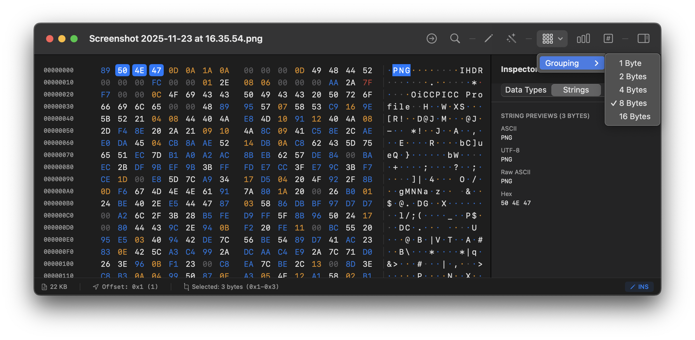
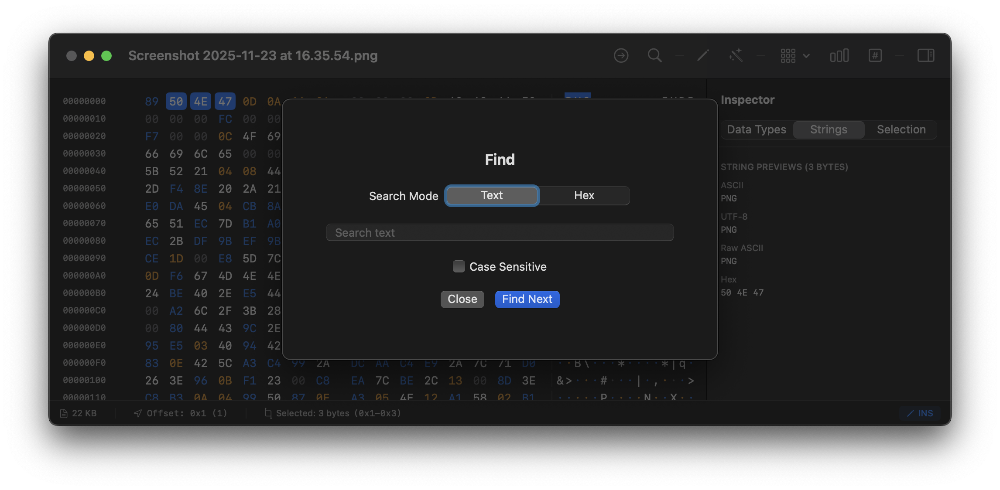
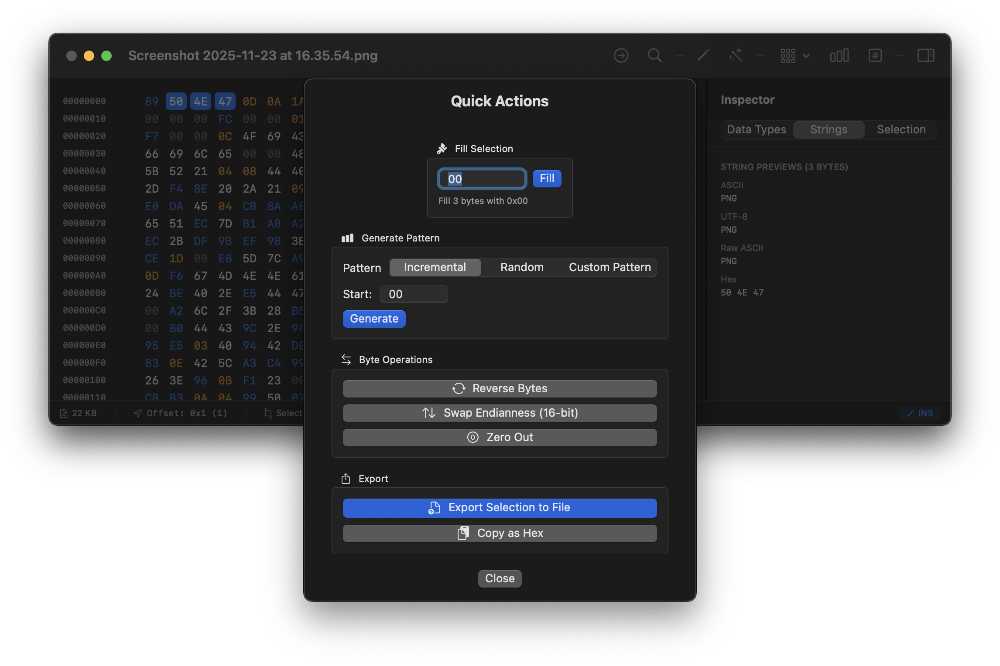

# HxEditor

A powerful, native macOS hex editor built with SwiftUI, featuring advanced editing capabilities, multiple byte selection, and an intuitive interface inspired by professional hex editors.

## Screenshots

### Main Interface

*Main hex editor view with byte grouping and dual hex/ASCII panes*

### Byte Grouping

*Configurable byte grouping for better readability*

### Inspector Panel

*Advanced data type interpretation and selection info*

### Find & Jump to Offset

*Search for hex patterns or ASCII text*


*Quickly navigate to any offset in the file*

### String Extraction

*Extract and browse ASCII and Unicode strings from binary files*

### File Comparison

*Side-by-side file comparison with synchronized scrolling and difference highlighting*

### Bitmap Visualizer

*Visualize binary data as images with adjustable width and pixel formats*

### Analysis Tools

*Calculate MD5, SHA-1, and SHA-256 checksums*


*Byte distribution and file statistics*

### Quick Actions

*Batch operations for efficient editing*

## Features

### Editing Capabilities

- **Multiple Byte Selection** - Drag to select, Shift+Arrow to extend selection
- **Dual Input Modes**
  - **ASCII Mode** - Type characters directly
  - **Hex Input Mode (⌘G)** - Enter hex values with two-digit input
- **Insert/Overwrite Modes** - Toggle between insert and overwrite editing
- **Advanced Operations**
  - Copy, Cut, Paste (⌘C, ⌘X, ⌘V)
  - Delete with Backspace
  - Duplicate selection (⌘D)
  - Zero out bytes (⌘0)
  - Select all (⌘A)

### Insert Data Dialog (⌘I)

Insert data in multiple formats:
- **ASCII** - Plain ASCII text
- **Hex** - Hex bytes (e.g., "FF 00 A1")
- **UTF-8** - Unicode text with emoji and international characters support
- Live preview showing byte count and hex representation

### Context Menu Operations

Right-click on any byte (hex or ASCII) for quick access to:
- Copy
- Paste
- Insert...
- Delete
- Zero Out
- Add/Remove Bookmark

### Navigation & Search

- **Jump to Offset (⌘J)** - Quickly navigate to any hex offset
- **Find (⌘F)** - Search for hex patterns or ASCII text
- **Bookmarks (⌘B)** - Mark important file positions
- **Arrow Key Navigation** - Move byte-by-byte
- **Shift+Arrow Selection** - Extend selection in any direction

### Inspector Panel

Optional side panel (toggle via toolbar) with three tabs:

1. **Data Types** - View selected bytes as:
   - Signed/Unsigned integers (8, 16, 32, 64-bit)
   - Floating point (32, 64-bit)
   - Binary representation
   - Little/Big endian support

2. **Strings** - Preview selection as:
   - ASCII (printable only)
   - UTF-8
   - Raw ASCII (with dots for non-printable)
   - Hex dump

3. **Selection Info** - View:
   - File size
   - Selection range (start, end, length)
   - Statistics (average, min, max byte values)

### String Extraction

Advanced string scanning tool with configurable options:

- **Scan entire file** for ASCII and Unicode strings
- **Configurable minimum length** - Set minimum string length (default: 4 characters)
- **String type filtering** - Toggle between ASCII and Unicode separately
- **Search and filter** - Search within found strings
- **Jump to location** - Click offset to navigate to string in hex view
- **One-click select** - Click any string to select it in the main editor
- **Copy strings** - Export found strings to clipboard
- **Live preview** - Shows string count, offset, length, and type

### File Comparison (Diff)

Professional side-by-side binary file comparison:

- **Side-by-side view** - Compare two files simultaneously
- **Synchronized scrolling** - Both files scroll together
- **Difference highlighting** - Color-coded difference blocks:
  - Modified bytes highlighted in red
  - Matching regions shown in normal colors
- **Block navigation** - Jump between difference blocks with ⌘[ and ⌘]
- **Smart diff algorithm** - Uses optimized rolling hash and Myers algorithm
- **Difference statistics** - Shows total blocks, bytes changed, and match percentage
- **Show only differences** - Toggle to hide matching regions
- **Large file support** - Efficient chunked comparison for files of any size

### Bitmap Visualizer

Visualize binary data as images:

- **Adjustable width** - Slider from 1 to 1024 pixels
- **Multiple pixel formats**:
  - Grayscale (1 byte per pixel)
  - RGB (3 bytes per pixel)
  - RGBA (4 bytes per pixel)
- **Zoom controls** - Scale from 50% to 1000%
- **Live rendering** - Updates as you adjust parameters
- **Identify patterns** - Spot visual patterns in binary data
- **Useful for**:
  - Detecting embedded images
  - Analyzing file structure
  - Finding repeating patterns
  - Reverse engineering binary formats

### Visual Features

- **Byte Grouping** - Configure grouping (1, 2, 4, 8, or 16 bytes)
- **Color-Coded Bytes** - Different colors for:
  - Printable ASCII (blue)
  - Control characters (gray)
  - Extended ASCII (purple)
  - High bytes (orange)
- **Selection Highlighting** - Clear visual feedback
- **Dual Pane View** - Side-by-side hex and ASCII representation
- **Hex Input Mode Indicator** - Shows current mode and partial input

### Analysis Tools

- **Statistics** - Byte distribution, entropy, patterns
- **Checksums** - Calculate MD5, SHA-1, SHA-256
- **Quick Actions** - Batch operations:
  - Fill selection with byte pattern
  - Generate patterns (incremental, random)
  - Reverse bytes
  - Swap endianness
  - Export selection

## Keyboard Shortcuts

### Navigation
- **Arrow Keys** - Move cursor
- **Shift+Arrows** - Extend selection
- **⌘A** - Select all

### Editing
- **⌘C** - Copy
- **⌘X** - Cut
- **⌘V** - Paste
- **⌘D** - Duplicate selection
- **⌘I** - Insert data dialog
- **Backspace** - Delete preceding byte
- **⌘0** - Zero out selection

### Modes
- **⌘G** - Toggle hex input mode
- **Tab** - Toggle between hex/ASCII pane focus

### Tools
- **⌘J** - Jump to offset
- **⌘F** - Find
- **⌘B** - Toggle bookmark
- **⌘[** - Previous difference (in comparison mode)
- **⌘]** - Next difference (in comparison mode)

## Installation

### Requirements
- macOS 13.0 or later
- Xcode 15.0 or later (for building from source)

### Building from Source

1. Clone the repository:
```bash
git clone https://github.com/yourusername/HxEditor.git
cd HxEditor
```

2. Open in Xcode:
```bash
open HxEditor.xcodeproj
```

3. Build and run (⌘R)

## Usage

### Opening Files

- Launch HxEditor and use File → Open (⌘O)
- Or drag and drop a file onto the app icon

### Basic Editing

1. **Click** a byte to select it
2. **Type** in ASCII mode or press **⌘G** for hex input mode
3. **Drag** to select multiple bytes
4. **Right-click** for context menu operations

### Inserting Data

1. Right-click at the desired position
2. Select "Insert..." (or press ⌘I)
3. Choose input mode (ASCII, Hex, or UTF-8)
4. Enter your data and click "Insert"

### Working with Selections

- **Drag** across bytes to select a range
- Hold **Shift** and use **arrow keys** to extend selection
- Press **⌘A** to select entire file
- Use **⌘D** to duplicate selected bytes

### Using the Inspector

1. Click the **Inspector** button in the toolbar
2. Select bytes to view their interpretation
3. Switch between Data Types, Strings, and Selection tabs
4. Toggle Little/Big endian in Data Types view

## Technical Details

### Architecture

- **SwiftUI** - Modern, declarative UI framework
- **Gap Buffer** - Efficient data structure for insert/delete operations
- **Lazy Loading** - Renders only visible rows for performance
- **Async State Updates** - Prevents UI blocking during operations

### Performance Optimizations

- **Smooth scrolling** with large files (10MB+)
- **Efficient memory usage** with gap buffer
- **Lazy rendering** of hex grid rows
- **Optimized selection** using range-based algorithm for instant performance
- **Chunked file comparison** for large file diffs
- **Rolling hash algorithm** (Rabin-Karp) for fast pattern matching
- **xxHash64** for high-speed chunk hashing

### Advanced Algorithms

- **Myers Diff Algorithm** - Industry-standard diff with optimizations
- **Rolling Hash (Rabin-Karp)** - Efficient substring matching
- **xxHash64** - Fast non-cryptographic hashing for comparisons
- **Gap Buffer** - O(1) insertion/deletion at cursor position
- **Range-based Selection** - O(1) selection queries vs O(n) with Sets

### File Format Support

- Universal binary file support
- No file size limits (within available memory)
- Preserves file permissions and attributes

## Project Structure

```
HxEditor/
├── HxEditor/
│   ├── HxEditorApp.swift              # App entry point
│   ├── ContentView.swift                # Main view with toolbar
│   ├── HexGridView.swift                # Hex/ASCII grid display
│   ├── HexRowView.swift                 # Individual row rendering
│   ├── FileInfoView.swift               # Inspector panel (legacy)
│   ├── InspectorView.swift              # Enhanced inspector panel
│   ├── DataBuffer.swift                 # Gap buffer implementation
│   ├── HexDocument.swift                # Document model
│   ├── InsertDataView.swift             # Insert data dialog
│   ├── SearchView.swift                 # Find dialog
│   ├── JumpToOffsetView.swift           # Jump dialog
│   ├── ChecksumView.swift               # Checksum calculator
│   ├── StatisticsView.swift             # File statistics
│   ├── QuickActionsView.swift           # Batch operations
│   ├── StatusBarView.swift              # Status bar
│   ├── BookmarkManager.swift            # Bookmark management
│   ├── HexInputHelper.swift             # Hex input mode logic
│   ├── ByteColorScheme.swift            # Color coding for bytes
│   ├── StringExtractor.swift            # String extraction engine
│   ├── StringsView.swift                # String extraction UI
│   ├── BitmapRenderer.swift             # Bitmap rendering engine
│   ├── BitmapView.swift                 # Bitmap visualizer UI
│   ├── ComparisonContentView.swift      # File comparison UI
│   ├── ComparisonHexGridView.swift      # Side-by-side hex view
│   └── DiffEngine.swift                 # File comparison algorithm
└── README.md
```

## Contributing

Contributions are welcome! Please feel free to submit a Pull Request.

## License

This project is licensed under the MIT License - see the LICENSE file for details.

## Acknowledgments

- Built with SwiftUI and modern macOS frameworks
- Uses CryptoKit for checksum calculations

## Future Enhancements

- [x] Find & Replace
- [ ] Data structure templates
- [x] Binary file comparison (Diff)
- [x] String extraction tool
- [x] Bitmap visualizer
- [ ] Plugin system
- [ ] Custom color schemes
- [x] Export to various formats (C array, Base64, etc.)
- [ ] Disassembler view
- [x] File metadata editor

---

**HxEditor** - A modern, powerful hex editor for macOS
